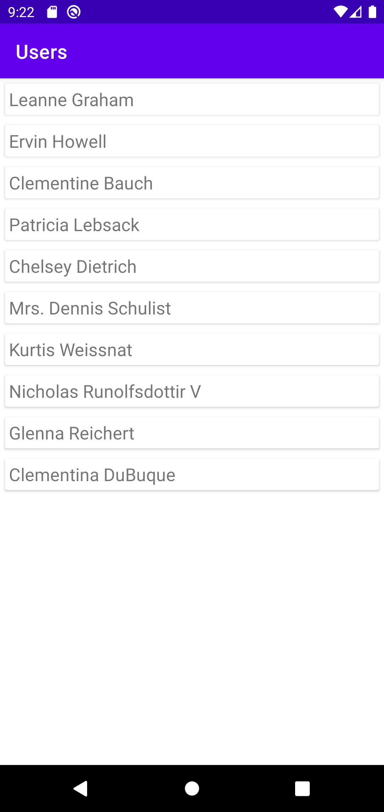
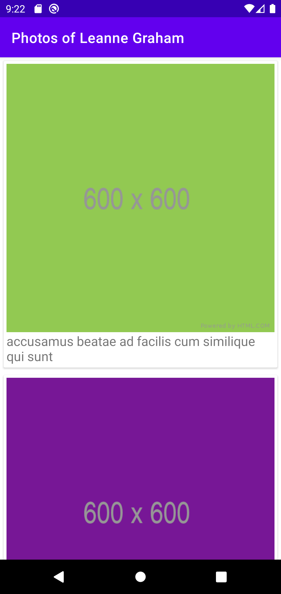

# GORA Studio code test

## Description

Code test for Android Junior Developer role in GORA Studio. Application displays list of users (screenshot 1)
and by clicking on one of the users, it shows all photos of selected user (screenshot 2).

  

  

## Architecture

The architecture is built around Android Architecture Components. Logic is kept away from Activities and Fragments and
moved to ViewModels. Data is observed using Live Data.

## Libraries Used

* [Architecture](https://developer.android.com/topic/libraries/architecture) - a collection of libraries that help you
  design robust, testable, and maintainable apps.
    * [ViewModel](https://developer.android.com/topic/libraries/architecture/viewmodel) - this class allows data to
      survive configuration changes such as screen rotations
    * [LiveData](https://developer.android.com/topic/libraries/architecture/livedata) - this is an observable data
      holder class.
* [Coil](https://coil-kt.github.io/coil/) - image loading library
* [Kotlin Coroutines](https://kotlinlang.org/docs/reference/coroutines-overview.html) - asynchronous or non-blocking
  programming
* [Retrofit](https://square.github.io/retrofit/) - a type-safe HTTP client
* [Timber](https://github.com/JakeWharton/timber) - a small logger class

